# Vietnamese TTS Course

An end-to-end learning guide for Vietnamese Text-to-Speech systems — from audio fundamentals to production deployment.

This course is built around the **[VieNeu-TTS](https://github.com/pnnbao97/VieNeu-TTS)** model and covers the full pipeline: how audio works, how Vietnamese text is processed, how modern neural TTS models are designed, and how to fine-tune and deploy your own Vietnamese voice.

---

## Who Is This For?

ML practitioners who know the basics (training loops, loss functions, backpropagation) but are new to **audio processing** and **TTS systems**. All examples use Vietnamese language data.

---

## Course Structure

| Chapter | Title | Key Concepts |
|---------|-------|-------------|
| [01](chapter-01.md) | Audio Fundamentals | Waveform, STFT, Mel spectrogram, MFCC, Nyquist theorem |
| [02](chapter-02.md) | Text Processing & Phonemization | Unicode normalization, Vietnamese tones, G2P, espeak-ng, tokenization |
| [03](chapter-03.md) | TTS Architecture Evolution | Concatenative → HMM → Tacotron 2 → FastSpeech 2 → VITS → LLM-TTS |
| [04](chapter-04.md) | Neural Audio Codecs | Vector quantization, RVQ, NeuCodec, DistillNeuCodec, token rate |
| [05](chapter-05.md) | LLM-Based TTS (VieNeu-TTS) | Prompt format, causal LM, RoPE, KV-cache, temperature sampling |
| [06](chapter-06.md) | Zero-Shot Voice Cloning | In-context cloning, speaker similarity, code-switching |
| [07](chapter-07.md) | LoRA Fine-tuning Theory | Low-rank adaptation, rank selection, memory savings, training dynamics |
| [08](chapter-08.md) | Data Preparation & Quality | SNR, tone distribution, filter pipeline, audio encoding |
| [09](chapter-09.md) | Training, Monitoring & Evaluation | Loss curves, CER, UTMOS, MOS test design, checkpoint selection |
| [10](chapter-10.md) | Deployment & Optimization | GGUF quantization, streaming, voices.json, RTF benchmark |

Each chapter has:
- A **theory file** (`.md`) — deep explanation with full math derivations
- A **hands-on notebook** (`.ipynb`) — runnable code with Vietnamese examples

---

## Learning Path

```mermaid
flowchart LR
    CH01["📻 01\nAudio Fundamentals"]
    CH02["📝 02\nText Processing"]
    CH03["🏛️ 03\nTTS Architectures"]
    CH04["🎛️ 04\nNeural Codecs"]
    CH05["🤖 05\nLLM-Based TTS"]
    CH06["🎙️ 06\nVoice Cloning"]
    CH07["🔧 07\nLoRA Theory"]
    CH08["📂 08\nData Preparation"]
    CH09["📈 09\nTraining & Eval"]
    CH10["🚀 10\nDeployment"]

    CH01 --> CH02
    CH02 --> CH03
    CH03 --> CH04
    CH04 --> CH05
    CH05 --> CH06
    CH05 --> CH07
    CH07 --> CH08
    CH08 --> CH09
    CH09 --> CH10
```



---

## Prerequisites

- Python 3.10+
- Basic ML knowledge: training loops, loss, gradient descent
- [VieNeu-TTS](https://github.com/pnnbao97/VieNeu-TTS) cloned and dependencies installed (`uv sync`)

---

## Getting Started

```bash
# Clone VieNeu-TTS (provides the models and example audio)
git clone https://github.com/pnnbao97/VieNeu-TTS.git
cd VieNeu-TTS
uv sync

# Clone this course into the learning/ folder
git clone https://github.com/thinhdanggroup/vietnamese-tts-course.git learning

# Launch notebooks
uv run jupyter lab learning/
```

Or read the theory files directly — each `.md` is self-contained.

---

## Vietnamese Focus

- All audio examples use Vietnamese speech
- Text examples cover all **6 tones**: ngang (a), huyền (à), sắc (á), hỏi (ả), ngã (ã), nặng (ạ)
- Code-switching (Vietnamese + English) covered in Chapters 2 and 6
- Regional dialect differences (Bắc / Trung / Nam) discussed in Chapters 2 and 8

---

## Topics Covered in Depth

**Audio & Signal Processing**
- Fourier Transform, STFT, Heisenberg-Gabor uncertainty principle
- Mel scale derivation, filterbank construction, MFCCs with DCT

**Vietnamese Linguistics**
- 6-tone phonology with F0 contours
- Syllable structure (C)(w)V(C)(T) and 3 regional dialects
- G2P pipeline: rule-based + dictionary + espeak-ng fallback

**Neural TTS Architectures**
- Tacotron 2 attention: location-sensitive alignment math
- FastSpeech 2: duration predictor, length regulator
- VITS: ELBO derivation from first principles, normalizing flows
- LLM-TTS: cross-entropy objective on speech tokens, in-context cloning

**Neural Codecs**
- VQ commitment loss, straight-through estimator
- RVQ iterative residual quantization
- Knowledge distillation: NeuCodec → DistillNeuCodec

**Fine-tuning**
- LoRA: full SVD-based derivation of W' = W + BA
- Memory savings math, rank sensitivity analysis
- Training loss patterns: healthy vs overfit vs unstable

**Evaluation**
- CER/WER (edit distance), MCD, UTMOS (neural MOS predictor)
- MOS test design with Vietnamese native speaker protocol

**Deployment**
- GGUF Q4/Q8 quantization math and RTF benchmarks
- Streaming inference with overlap-add
- voices.json packaging for portable model distribution

---

## Related

- [VieNeu-TTS](https://github.com/pnnbao97/VieNeu-TTS) — the model this course is built around
- [NeuCodec](https://huggingface.co/neuphonic/distill-neucodec) — the audio codec used
- [espeak-ng](https://github.com/espeak-ng/espeak-ng) — phonemization backend

---

## License

MIT
